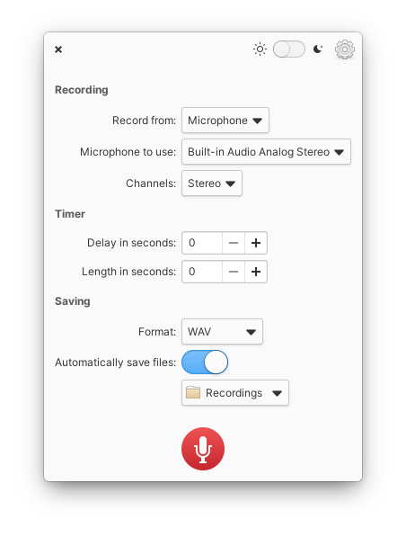

# Reco

Reco is an audio recording app designed for elementary OS.

Useful when:

* you join a discussion and take your minutes later
* you want to record talk with your friends or lover
* you want to stream videos on the Internet

Features Include:

* Timed recording
* Available format: AAC, FLAC, MP3, Ogg Vorbis, Opus and WAV

## Installation

### For Users

On elementary OS? Hit the button to get Reco:

#### Arch Linux

Arch Linux users can find Reco under the name [reco-git](https://aur.archlinux.org/packages/reco-git/) in the AUR (thanks to [btd1337](https://github.com/btd1337)):

    aurman -S reco-git

### For Developers

You'll need the following dependencies:

* libgtk-3.0-dev
* libgranite-dev
* libgstreamer1.0-dev
* meson
* valac

Run `meson build` to configure the build environment. Change to the build directory and run `ninja` to build

    meson build --prefix=/usr
    cd build
    ninja

To install, use `ninja install`, then execute with `com.github.ryonakano.reco`

    sudo ninja install
    com.github.ryonakano.reco

## A Story Behind This App

One day when I joined a discussion in my department, I had to take a minutes with my elementary laptop. The discussion was so high-paced that I couldn't hear and write down everything into the minutes. After coming back home I searched for a sound recorder designed for elementary OS but couldn't, althought there were some non-elementary apps like GNOME Sound Recorder. I decided to create one designed for and fits in elementary OS.
