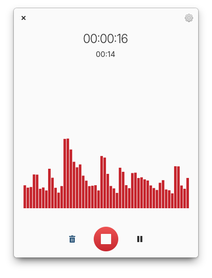

# Reco

Reco is an audio recorder focused on being concise and simple to use.

You can use it to record and remember spoken words, system audio, improvized melodies, and anything else you can do with a microphone, speaker, or both.

 

Features include:

* **Recording sounds from both your microphone and system at the same time.** This is useful for recording calls or streaming videos on the Internet.
* **Saving in many commonly used formats.** It supports ALAC, FLAC, MP3, Ogg Vorbis, Opus, and WAV.
* **Timed recording.** You can set a delay before recording up to 15 seconds, and set the length of recording up to 600 seconds.
* **Choosing where to save recordings.** You can select whether the app saves recordings into a directory of your choosing automatically or manually.
* **Saving recordings when the app quits.** Even if you happen to quit the app while recording, the recording is either saved automatically, or the file chooser dialog is shown - depending on your preferences.

## Installation

### For Users

On elementary OS? Click the button to get Reco on AppCenter:

[](https://appcenter.elementary.io/com.github.ryonakano.reco)

You can also download the app from Flathub, in case you're using another distribution.

[](https://flathub.org/apps/details/com.github.ryonakano.reco)

Community packages maintained by volunteers are also available on some distributions:

[](https://repology.org/project/reco/versions)

### For Developers

You'll need the following dependencies to build:

* libgee-0.8-dev
* libgranite-7-dev
* libgstreamer1.0-dev (>= 1.20)
* libgtk-4-dev (>= 4.10)
* [libryokucha](https://github.com/ryonakano/ryokucha)
    * automatically downloaded on build
* [livechart](https://github.com/lcallarec/live-chart) (>= 1.10.0)
    * automatically downloaded on build
* meson (>= 0.57.0)
* valac

You'll need the following dependencies to run:

* gstreamer1.0-libav (use the same version with libgstreamer1.0-dev)

Run `meson setup` to configure the build environment and run `ninja` to build

```bash
meson setup builddir --prefix=/usr
ninja -C builddir
```

To install, use `ninja install`, then execute with `com.github.ryonakano.reco`

```bash
ninja install -C builddir
com.github.ryonakano.reco
```

## Contributing

Please refer to [the contribution guideline](.github/CONTRIBUTING.md) if you would like to:

- submit bug reports / feature requests
- propose coding changes
- translate the project

## Get Support

Need help in use of the app? Refer to [the discussions page](https://github.com/ryonakano/reco/discussions) to search for existing discussions or [start a new discussion](https://github.com/ryonakano/reco/discussions/new/choose) if none is relevant.

## The Story Behind This App

This app was originally designed and released for elementary OS.

One day, I had to take minutes for a meeting in my department with my elementary laptop. The discussion was so fast-paced, though, that I couldn't listen and write down everything in the minutes. When I got home, I searched for a sound recorder app. I found some non-elementary apps like GNOME Sound Recorder, but there were none for elementary OS. Thus, I decided to create one designed for elementary OS.
