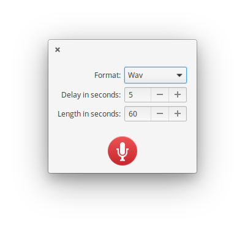

# Reco

Reco is an audio recording app designed for elementary OS.

Features include:

* **Recording from both your microphone and system sound.** This would be useful when you record conversations with chat apps or stream videos on the Internet
* **Saving in some commonly used formats.** It supports AAC, FLAC, MP3, Ogg Vorbis, Opus, and WAV
* **Timed recording.** You can set a delay before recording up to 15 seconds, and the length of recording up to 600 seconds
* **Autosaving or do-not-ask-where-to-save workflow.** You can select whether the app saves recordings automatically or you choose a destination each time on saving them
* **Save recording when the app quits.** Even if you happen to quit the app while recording, the recording is saved automatically or a FileChooserDialog is shown depends on your saving setting

## Installation

### For Users

On elementary OS? Click the button to get Reco on AppCenter:

#### Arch Linux

Arch Linux users can find Reco under the name [reco-git](https://aur.archlinux.org/packages/reco-git/) in the AUR (thanks to [btd1337](https://github.com/btd1337)):

    aurman -S reco-git

### For Developers

You'll need the following dependencies:

* libgtk-3.0-dev
* libgranite-dev (>= 5.2.3)
* libgstreamer1.0-dev
* meson
* valac

Run `meson build` to configure the build environment. Change to the build directory and run `ninja` to build

    meson build --prefix=/usr
    cd build
    ninja

To install, use `ninja install`, then execute with `com.github.ryonakano.reco`

    sudo ninja install
    com.github.ryonakano.reco

## Contributing

There are many ways you can contribute, even if you don't know how to code.

### Reporting Bugs or Suggesting Improvements

Simply [create a new issue](https://github.com/ryonakano/reco/issues/new) describing your problem and how to reproduce or your suggestion. If you are not used to do, [this section](https://elementary.io/docs/code/reference#reporting-bugs) is for you.

### Writing Some Code

We follow the [coding style of elementary OS](https://elementary.io/docs/code/reference#code-style) and [its Human Interface Guidelines](https://elementary.io/docs/human-interface-guidelines#human-interface-guidelines), please try to respect them.

### Translating This App

I accept translations through Pull Requests. If you're not sure how to do, [the guideline I made](po/README.md) might be helpful.

## The Story Behind This App

One day, I had to take minutes for a meeting in my department with my elementary laptop. The discussion was so fast-paced, though, that I couldn't listen and write down everything in the minutes. When I got home, I searched for a sound recorder app. I found some non-elementary apps like GNOME Sound Recorder, but there were none for elementary OS. Thus, I decided to create one designed for elementary OS.
